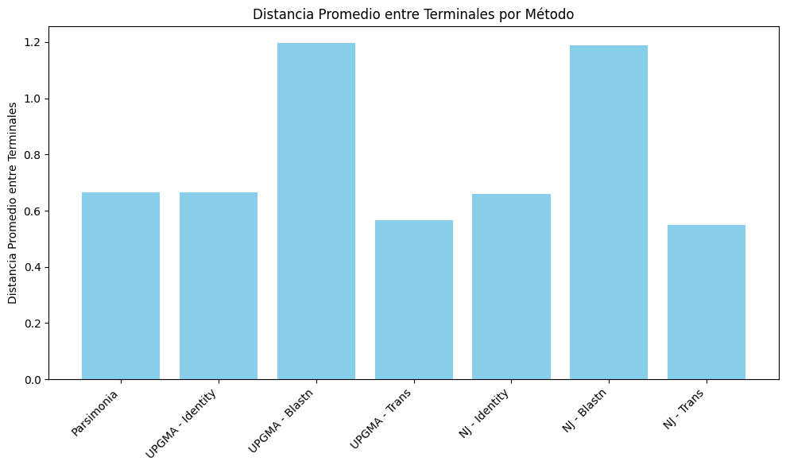

# Análisis y Modificación de Árboles Filogenéticos

Este documento presenta un conjunto de ejercicios prácticos centrados en el análisis, modificación y generación de árboles filogenéticos utilizando herramientas bioinformáticas. A continuación, se describen los objetivos, métodos y resultados obtenidos en cada ejercicio.

---

## **Ejercicio 1: Análisis de un Árbol Filogenético Existente**

### Descripción:
Se analizó un árbol filogenético en formato **Newick**, construido a partir de secuencias de la subunidad beta 1 de la hemoglobina. Este árbol refleja las relaciones evolutivas entre especies de peces, aves y mamíferos.

### Detalles del análisis:
- **Número de terminales:** 22 (especies individuales).
- **Número de nodos o clados:** 42.
- **Longitudes de ramas:** Varían entre 0.0 y 1.13866, reflejando diferentes niveles de divergencia evolutiva.
- **Especies más cercanas:** KX241132.1 y KX241142.1 (distancia 0.0).
- **Especie más distante:** MZ593243.1, con una distancia acumulada de 29.5649.

### Visualización:
El árbol permite observar agrupamientos claros entre linajes específicos y divergencias evolutivas significativas. Se identificaron clados compactos y linajes altamente divergentes.

### Código principal:
- **Análisis:** Determinación de terminales, nodos, distancias y patrones de agrupamiento.

```python
def analyze_tree(newick_file):
    tree = Phylo.read(newick_file, "newick")
    
    num_terminals = len(tree.get_terminals())
    num_clades = len(list(tree.find_clades()))
    branch_lengths = [clade.branch_length for clade in tree.find_clades() if clade.branch_length is not None]  # Longitudes de las ramas
    terminal_names = [terminal.name for terminal in tree.get_terminals()]
    
    clades_with_bootstrap = [(clade.confidence, clade) for clade in tree.find_clades() if clade.confidence is not None]
    best_bootstrap, best_clade = (None, None)
    if clades_with_bootstrap:
        best_bootstrap, best_clade = max(clades_with_bootstrap, key=lambda x: x[0])
    
    min_distance, closest_pair = float('inf'), None
    for (name1, name2) in combinations(terminal_names, 2):
        distance = tree.distance(name1, name2)
        if distance < min_distance:
            min_distance = distance
            closest_pair = (name1, name2)
    
    max_distance, most_distant_species = float('-inf'), None
    for name in terminal_names:
        total_distance = sum(tree.distance(name, other) for other in terminal_names if other != name)
        if total_distance > max_distance:
            max_distance = total_distance
            most_distant_species = name
    
    print(f"Información del árbol filogenético:")
    print(f"Número de terminales: {num_terminals}")
    print(f"Número de nodos/clados totales: {num_clades}")
    print(f"Longitudes de las ramas: {branch_lengths}")
    print(f"Nombres de terminales: {terminal_names}")

    if best_clade:
        print(f"Clado con el mejor bootstrap: {best_bootstrap}")

    if closest_pair:
        print(f"Especies más parecidas: {closest_pair} con distancia {min_distance}")
        
    if most_distant_species:
        print(f"Especie más distante al resto: {most_distant_species} con distancia total {max_distance}")
    
    return tree, closest_pair, most_distant_species
```

El resultado de ejecutar esta función sobre el árbol generado a partir de la hemoglobina fue el siguiente:

```python
newick_file = "./data/hbb_tree.txt"
tree, closest_pair, most_distant_species = analyze_tree(newick_file)
```

```text
Información del árbol filogenético:
Número de terminales: 22
Número de nodos/clados totales: 42
Longitudes de las ramas: [0.205701, 1.13866, 0.031261, 0.136879, 0.133087, 0.230584, 0.190835, 0.0953875, 0.162102, 0.28055, 0.0278707, 0.0186001, 0.0572805, 0.241457, 0.0286879, 0.0473548, 0.0106191, 0.00200754, 0.0021201, 0.00865119, 0.00195866, 0.0066246, 0.00852267, 5e-09, 0.0, 0.0, 0.0230908, 0.0215049, 0.00236303, 0.0103989, 0.012181, 0.0269614, 0.00456229, 0.00824827, 0.0273313, 0.00829855, 0.00242122, 0.023679, 0.00222634, 0.00210352, 0.00853381]
Nombres de terminales: ['AB364477.1', 'MZ593243.1', 'BT074827.1', 'BT082972.1', 'MT164172.1', 'NM_001160555.2', 'BT059665.1', 'OL804561.1', 'KX241110.1', 'KX241171.1', 'KX241173.1', 'KX241147.1', 'KX241132.1', 'KX241142.1', 'KX241189.1', 'KX241204.1', 'KX241222.1', 'KX241216.1', 'KX241252.1', 'KX241297.1', 'KX241301.1', 'KX241309.1']
Especies más parecidas: ('KX241132.1', 'KX241142.1') con distancia 0.0
Especie más distante al resto: MZ593243.1 con distancia total 29.56490544
```

- **Visualización:** Personalización del árbol para resaltar relaciones clave.

```python
def plot_tree(tree, color_dict=None, branch_width=2):
    if color_dict:
        for clade in tree.find_clades():
            if clade.name in color_dict:
                clade.color = color_dict[clade.name]

    def color_func(clade):
        return getattr(clade, "color", "black")

    plt.figure(figsize=(15, 8))
    ax = plt.gca()

    Phylo.draw(tree, axes=ax, branch_labels=None, label_colors=color_func, do_show=False)

    for line in ax.findobj(match=lambda obj: isinstance(obj, plt.Line2D)):
        line.set_linewidth(branch_width)

    plt.title("Árbol Filogenético de la Subunidad Beta de la Hemoglobina")
    plt.show()
```

Esta función mostrará el árbol filogenético mediante el uso de la librería `matplotlib`, cosa que es autogestionada por biopython directamente, destacando en color rojo la especie más alejada genéticamente del resto. El resultado de esta función para el árbol de estudio se puede ver en la Figura 1.

<div align="center">
    
    <p><b>Figura 1.</b> Árbol filogenético generado con la subunidad beta de la hemoglobina en distintos organismos.</p>
</div>

---

## **Ejercicio 2: Modificación de un Árbol Filogenético**

### Descripción:
Se modificó el árbol filogenético del ejercicio anterior para alterar nombres de especies, longitudes de ramas y colores de algunas conexiones. Estas modificaciones destacan relaciones clave entre especies.

### Cambios realizados:
1. **Cambio de nombres:**
   - KX241132.1 → *Eriocnemis luciani*.
   - KX241142.1 → *Haplophaedia aureliae*.
   - MZ593243.1 → *Arenicola marina*.
   
2. **Ajuste de longitudes:**
   - Las ramas que conectan *Eriocnemis luciani* y *Haplophaedia aureliae* se establecieron en 0.5.
   - La rama de *Arenicola marina* se ajustó a 0.9.

3. **Colores asignados:**
   - Azul para *Eriocnemis luciani* y *Haplophaedia aureliae*.
   - Rojo para *Arenicola marina*.

### Resultados:
El árbol modificado resalta visualmente las especies más cercanas y la más distante, facilitando su interpretación.

### Código principal:
- Funciones para cambiar nombres, ajustar longitudes y asignar colores.

```python
def modify_tree(tree):
    for clade in tree.find_clades():
        if clade.name == 'KX241132.1':
            clade.name = 'Eriocnemis luciani (KX241132.1)'

        elif clade.name == 'KX241142.1':
            clade.name = 'Haplophaedia aureliae (KX241142.1))'

        elif clade.name == 'MZ593243.1':
            clade.name = 'Arenicola marina (MZ593243.1)'

    for clade in tree.find_clades():
        if clade.name in ['Eriocnemis luciani (KX241132.1)', 'Haplophaedia aureliae (KX241142.1))']:
            clade.branch_length = 0.5
            clade.color = 'blue'

        elif clade.name == 'Arenicola marina (MZ593243.1)':
            clade.branch_length = 0.9
            clade.color = 'red'

    return tree
```

- Función para visualizar el árbol, similar a la del ejercicio anterior aunque con algunas modificaciones.
- Guardado del árbol modificado en formato Newick para futuras referencias.

 El resultado de este ejercicio se puede ver en la Figura 2, donde se han destacado las especies mencionadas tal y como se ha descrito.

<div align="center">
    
    <p><b>Figura 2.</b> Árbol filogenético modificado, destacando tanto la rama más lejana como las más cercancas entre sí.</p>
</div>

---

## **Ejercicio 3: Generación de Árboles Filogenéticos desde Secuencias Aleatorias**

### Descripción:
Se generaron árboles filogenéticos a partir de secuencias de nucleótidos creadas de manera aleatoria. Estas secuencias se almacenaron en un archivo **FASTA** para su posterior análisis.

### Pasos realizados:
1. **Generación de secuencias:**
   - Se crearon 5 secuencias de 5 nucleótidos de forma aleatoria.
   - Se almacenaron en el archivo `./fasta_files/secuencias.fasta`.

2. **Métodos empleados:**
   - **Máxima parsimonia:** Construcción de un árbol filogenético basado en la minimización de eventos evolutivos.
   - **Métodos de distancia:**
     - **UPGMA:** Generación de árboles basados en distancias promedio entre grupos.
     - **Neighbor Joining (NJ):** Método de agrupamiento progresivo para generar árboles filogenéticos.

3. **Cálculo de distancias:**
   - Distancias calculadas con medidas como "identity", "blastn", y "trans".

### Comparación de resultados:
- Los árboles generados mediante máxima parsimonia y métodos de distancia mostraron patrones similares en agrupamientos cercanos, pero diferencias en ramas más largas.
- UPGMA mostró una estructura más balanceada, mientras que NJ destacó mejor las diferencias evolutivas.

### Código principal:
- Generación de secuencias y archivo FASTA.

```python
def generar_secuencia(longitud):
    nucleotidos = ['A', 'T', 'C', 'G']
    return ''.join(random.choice(nucleotidos) for _ in range(longitud))
```

```python
def crear_fasta(nombre_archivo, num_secuencias, longitud):
    with open(nombre_archivo, 'w') as archivo:
        for i in range(1, num_secuencias + 1):
            secuencia = generar_secuencia(longitud)
            archivo.write(f">Secuencia_{i}\n")  # Encabezado FASTA
            archivo.write(f"{secuencia}\n")
```

```python
nombre_archivo = "./fasta_files/secuencias.fasta"
num_secuencias = 5
longitud_secuencia = 5

crear_fasta(nombre_archivo, num_secuencias, longitud_secuencia)

print(f"Archivo {nombre_archivo} generado con {num_secuencias} secuencias de {longitud_secuencia} nucleótidos.")
```

### Genración y comparación de los árboles/resultados

Los árboles obtenidos a partir de las secuencias aleatorias son los presentados en la Figura 3.

<div align="center">
    
    <p><b>Figura 3.</b> Árboles filogenéticos obtenidos mediante cada método.</p>
</div>

### Comparación de medidas numéricas

Posteriormente, se han obtenido medidas numéricas a partir de los diversos árboles que se presentan en la siguiente tabla:

| **Métrica**                          | **Parsimonia** | **UPGMA - Identity** | **UPGMA - Blastn** | **UPGMA - Trans** | **NJ - Identity** | **NJ - Blastn** | **NJ - Trans** |
|--------------------------------------|----------------|-----------------------|---------------------|-------------------|-------------------|-----------------|-----------------|
| **Longitud Total del Árbol**         | 1.6            | 1.6                  | 2.88               | 1.4               | 1.6               | 2.88            | 1.28            |
| **Profundidad Máxima**               | 0.4875         | 0.4125               | 0.7425             | 0.3825            | 0.5               | 1.02            | 0.6             |
| **Longitud Promedio de Ramas**       | 0.2            | 0.2                  | 0.36               | 0.175             | 0.266667          | 0.411429        | 0.182857        |
| **Número de Nodos Internos**         | 4              | 4                    | 4                  | 4                 | 3                 | 3               | 3               |
| **Número de Nodos Terminales**       | 5              | 5                    | 5                  | 5                 | 5                 | 5               | 5               |
| **Balance del Árbol**                | Counter({2: 2, 5: 1, 4: 1}) | Counter({5: 1, 4: 1, 3: 1, 2: 1}) | Counter({5: 1, 4: 1, 3: 1, 2: 1}) | Counter({5: 1, 4: 1, 3: 1, 2: 1}) | Counter({5: 1, 3: 1, 2: 1}) | Counter({2: 2, 5: 1}) | Counter({5: 1, 3: 1, 2: 1}) |
| **Distancia Promedio entre Terminales** | 0.665        | 0.665                | 1.197              | 0.565             | 0.66              | 1.188           | 0.548           |
| **Número de Bifurcaciones**          | 4              | 4                    | 4                  | 4                 | 3                 | 3               | 3               |
| **Es Ultramétrico**                  | False          | True                 | True               | True              | False             | False           | False           |

Donde:

- La longitud total del árbol es la suma de todas las longitudes de las ramas. Esto puede interpretarse como una medida de la divergencia acumulada entre las secuencias.
- La profundidad máxima del árbol mide la distancia evolutiva máxima desde la raíz hasta cualquier nodo terminal. Es útil para comparar niveles de divergencia.
- La longitud promedio de las ramas te da una idea del grado promedio de divergencia entre los nodos.
- El número de nodos internos y hojas (terminales) puede describir la complejidad y resolución del árbol.
- El balance del árbol mide la simetría entre las ramas. Árboles muy desbalanceados pueden indicar una alta disparidad en las tasas evolutivas entre los linajes.
- La distancia promedio entre nodos terminales mide la divergencia promedio entre todas las secuencias.
- El número de bifurcaciones en el árbol puede proporcionar información sobre la resolución del árbol y los posibles puntos de especiación.
- Se verifica si el árbol UPGMA es ultramétrico, es decir, si todas las hojas tienen la misma distancia desde la raíz.


### Visualización de las métricas

Con la finalidad de observar de forma más clara las métricas presentadas, se han realizado las siguientes visualizaciones donde las conclusiones más detalladas se encuentran en el *notebook*:

#### 1. Longitud del árbol y longitud promedio de ramas

<p align="center">
      
    <p align="center"><b>Figura 4.</b> Longitud del árbol y longitud promedio de ramas</p>
</p>

La Figura 4 presenta las gráficas que comparan las longitudes del árbol y sus promedio de longitud de las ramas en función del método utilizado. En general, las diferencias en la longitud total y promedio reflejan cómo cada método interpreta y representa las relaciones evolutivas entre las secuencias. Los métodos como Parsimonia son más conservadores, mientras que Blastn tiende a maximizar las distancias.

#### 2. Profundidad máxima del árbol y número de nodos internos y terminales

<div align="center">
  
  
</div>
<div align="center">
  <b>Figura 5.</b> Profundidad máxima &nbsp;&nbsp;&nbsp;&nbsp;&nbsp;&nbsp;&nbsp;&nbsp;&nbsp;&nbsp; <b>Figura 6.</b> Número de nodos internos y terminales
</div>

<br>

Las Figuras 5 y 6 proporcionan información sobre la profundidad máxima y el número de nodos internos y terminales de los árboles resultantes de cada método. Por un lado, la profundidad máxima es un indicador clave de la divergencia evolutiva reflejada en los árboles, y los métodos Blastn parecen ser los más sensibles para capturar esta variabilidad, mientras que los métodos como Parsimonia y UPGMA - Identity se enfocan en representaciones más compactas y directas. Esto destaca la influencia del modelo y la distancia utilizada en la construcción de los árboles. Por otro lado, la Figura 6 destaca diferencias importantes en la estructura de los árboles según el método utilizado, mostrando cómo cada algoritmo prioriza la complejidad topológica y la relación evolutiva entre las secuencias.

#### 3. Balance del árbol

<p align="center">
      
    <p align="center"><b>Figura 7.</b> Balance del árbol</p>
</p>

1. **Parsimonia y NJ - Blastn**: Estos métodos son más propensos a generar árboles desbalanceados, lo cual puede reflejar una alta disparidad en las tasas evolutivas entre diferentes linajes o una optimización específica en sus algoritmos.
2. **UPGMA**: Este método tiende a construir árboles altamente balanceados, reflejando su suposición de evolución uniforme y crecimiento simétrico.
3. **Diferencias entre NJ y UPGMA**: Neighbor Joining es más sensible a las disparidades evolutivas, lo que se observa en el caso de NJ - Blastn, mientras que UPGMA es más conservador y mantiene el equilibrio entre las ramas.

#### 4. Distancia promedio entre terminales por tipo de métodos y número de bifurcaciones

<div align="center">
  
  
</div>
<div align="center">
  <b>Figura 8.</b> Distancia promedio entre terminales por tipo de métodos &nbsp;&nbsp;&nbsp;&nbsp;&nbsp;&nbsp;&nbsp;&nbsp;&nbsp;&nbsp; <b>Figura 9.</b> Número de bifurcaciones
</div>

<br>

Por un lado, de la Figura 8, se puede extraer la conclusión de que los métodos basados en Blastn destacan por su sensibilidad a pequeñas diferencias evolutivas, mientras que Parsimonia, Identity y Trans priorizan la simplicidad y generan árboles más compactos y conservadores, adecuados para secuencias similares.
Por otro lado, la Figura 9 muestra que los métodos de Parsimonia y UPGMA destacan por su alta resolución y capacidad para identificar múltiples bifurcaciones evolutivas, ideales para análisis detallados, mientras que NJ genera árboles más simples, adecuados para visiones generales.

---

## **Conclusiones Generales**

1. **Comparación de Métodos**:  
   - **Parsimonia**: Produce árboles más conservadores con longitudes moderadas y un balance entre profundidad y número de bifurcaciones. Es ideal para datos simples y bien caracterizados.
   - **UPGMA**: Genera árboles balanceados y con menor profundidad, reflejando su asunción de una evolución uniforme. Es adecuado para análisis rápidos y conservadores.
   - **Neighbor Joining (NJ)**: Más sensible a variaciones evolutivas y divergencias, con árboles generalmente más largos y profundos. Es útil para representar datos con tasas evolutivas heterogéneas.

2. **Influencia de las Distancias**:  
   - Las distancias utilizadas (Blastn, Identity, Trans) afectan significativamente la interpretación de las relaciones evolutivas. Las distancias como Blastn tienden a generar árboles más largos y profundos, mientras que Identity y Trans producen estructuras más compactas y conservadoras.

3. **Efectos en los Parámetros de los Árboles**:  
   - Los parámetros como la profundidad máxima, el número de nodos internos/terminales, y las bifurcaciones varían dependiendo del método y las distancias empleadas. Esto destaca la importancia de seleccionar cuidadosamente el enfoque metodológico según los objetivos del análisis.

4. **Recomendaciones Generales**:  
   - **Para análisis detallados**: Métodos como Parsimonia y UPGMA con distancias más sensibles (Blastn) son útiles para capturar diferencias evolutivas finas.
   - **Para una visión general**: Métodos como NJ con distancias menos sensibles (Identity o Trans) pueden proporcionar árboles más simples y directos.

En resumen, los resultados demuestran que la aleatoriedad en los datos iniciales, junto con la elección del método y la distancia, influye profundamente en las conclusiones filogenéticas. Una aproximación combinada, utilizando múltiples métodos y distancias, ofrece una perspectiva más robusta y confiable de las relaciones evolutivas.

---

## **Archivos Generados**

1. **Árbol inicial:** `hbb_tree.txt`.
2. **Árbol modificado:** `modified_hbb_tree.txt`.
3. **Secuencias FASTA:** `./fasta_files/secuencias.fasta`.
4. **Resultados visuales:** Gráficos de los árboles generados para cada método.

Este conjunto de ejercicios ilustra cómo analizar, modificar y generar árboles filogenéticos, destacando las herramientas bioinformáticas y su aplicación en estudios evolutivos.
